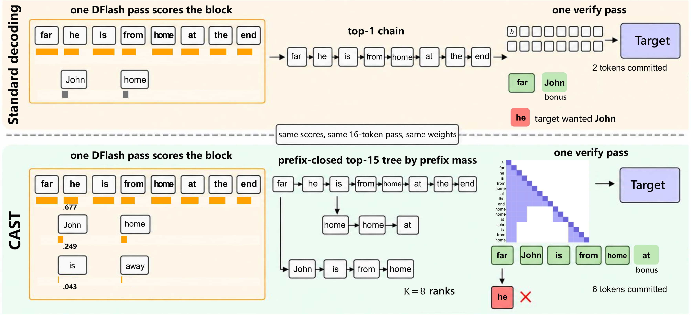
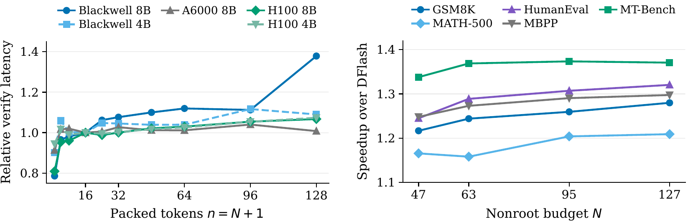

<p align="center">
  
</p>

<div align="center">

[](https://arxiv.org/abs/2610.00321)
[](LICENSE)
[](https://creativecommons.org/licenses/by/4.0/)
[](https://www.python.org/)
[](https://github.com/js-lee-AI/CAST/actions/workflows/ci.yml)
[](https://github.com/js-lee-AI/CAST/stargazers)

<b><a href="#quick-start">Quick start</a> · <a href="#usage">Usage</a> · <a href="#command-line">CLI</a> · <a href="#results">Results</a> · <a href="#reproduce-the-paper">Reproduce</a> · <a href="#faq">FAQ</a> · <a href="#citation">Citation</a></b>

</div>

---

## News

- **[2026-09-28]** Code released, together with the measured timings and latency probes behind the paper's tables and the scripts that rebuild them on a CPU.

## Overview

Block drafters such as [DFlash](https://github.com/z-lab/dflash) score a whole block of future tokens in one forward pass, yet standard speculative decoding verifies only the top-scoring chain and discards the other candidates. Those candidates are already scored, so verifying more of them adds target computation but no extra drafting. How many more is worth it depends on the deployment, because the price of a wider verification pass differs across GPUs and targets.

CAST (Cost-Aware Speculative Trees) packs these candidates into a tree and verifies it in a single target pass, leaving the target model, the drafter weights and the decoding rule untouched. It rests on three ideas.

* **Keep the highest-scoring candidates.** CAST ranks each candidate sequence by the product of the drafter's probabilities along it. The top-N sequences form a prefix-closed tree that maximizes the expected number of accepted tokens under these scores for any width N (paper Theorem 1).
* **Price the width by measured latency.** The tree takes the next candidate while its chance of acceptance exceeds the tokens the decoder would produce, at its current speed, during the verification time that the candidate adds (paper Theorem 2). The drafter's scores and a short latency probe are all it needs, so the width adapts to each deployment without a sweep over widths.
* **Keep the target's output.** The whole tree is verified in one ancestor-masked target pass, and CAST leaves the target output distribution unchanged under both greedy and sampled decoding (paper Theorem 3). At its predicted width, CAST is faster than the standard chain in all eight settings of the paper, by up to 43%.

```
add node N+1 while   ρ(N+1)  ≥  (g(N) + 1) / ℓ(N)  ×  c1

ρ(N+1)            prefix mass of the next candidate, from the drafter's scores
(g(N) + 1) / ℓ(N) throughput of the width-N tree in tokens per ms
c1                verification time that one more packed token adds, in ms
```

This repository is CAST as a small library, plus the measured summaries and the scripts that reproduce the paper.

## What it does in one picture

<p align="center">
  
</p>

<p align="center"><em>One round of standard DFlash decoding (top) and CAST (bottom) on a GSM8K prompt, with the same drafter scores and one verification pass of 16 packed tokens. Standard decoding verifies only the top-1 chain, whereas CAST verifies a prefix-closed tree of the 15 highest-scoring candidates under an ancestor mask (paper Figure 1).</em></p>

## Quick start

```bash
pip install "git+https://github.com/js-lee-AI/CAST.git"
```

```python
import numpy as np
import cast_trees

# Target-forward latency (ms) by packed tokens, H100 SXM, Qwen3-8B (paper Table 5)
n, ms = [16, 24, 32, 48, 64, 96, 128], [30.6, 30.2, 30.6, 31.2, 31.5, 32.2, 32.6]
width = cast_trees.predict_width(n, ms)
print(width)

# Toy one-pass block scores, 15 future positions over a 64-token vocabulary
top_idx, top_lp = cast_trees.block_topk(np.random.default_rng(0).normal(scale=5, size=(15, 64)))
for label, nodes in [("DFlash chain", cast_trees.build_chain(top_idx, top_lp, 15)),
                     ("CAST, N=15", cast_trees.build_tree(top_idx, top_lp, 15)),
                     (f"CAST, N={width.n_star}", cast_trees.build_tree(top_idx, top_lp, width.n_star))]:
    print(f"{label:13s} {len(nodes):3d} nodes, expected accepted tokens "
          f"{cast_trees.expected_accepted_length(nodes):.2f}")

# c1 = 0.0211 ms per packed token, the rule stops at N=120, N* = 127
# DFlash chain   15 nodes, expected accepted tokens 1.01
# CAST, N=15     15 nodes, expected accepted tokens 1.78
# CAST, N=127   127 nodes, expected accepted tokens 3.54
```

This runs on a CPU in well under a second and downloads nothing. The same code is [`examples/quickstart.py`](examples/quickstart.py), and CI runs it on every push. The H100 SXM cost curve is nearly flat, so the rule keeps adding candidates almost to the end of the mass curve and deploys the largest width of the grid, N\* = 127, as in the paper. At the same 15 nodes the tree already expects more accepted tokens than the chain, and the wider tree expects more again.

| install | adds | enough for |
|---|---|---|
| `pip install "git+https://github.com/js-lee-AI/CAST.git"` | numpy | the width rule, tree building, the quickstart and the `cast-trees` command |
| `pip install "cast-trees[decode] @ git+https://github.com/js-lee-AI/CAST.git"` | torch, transformers, datasets, triton and DFlash at a fixed commit | decoding with a real target and drafter on a GPU |
| `git clone` and then `pip install -e ".[test]"` | pytest | `experiments/`, `data/` and `tests/` |

The CPU part passes its tests on Python 3.10, 3.11 and 3.13 with numpy 1.26 to 2.5, and CI runs them on Python 3.10 and 3.13. The paper's timings ran in bf16 on one GPU with PyTorch 2.9.1 or 2.11.

## Usage

### Pick the width for your GPU

Measure the target-forward latency at a few packed-token counts on your own GPU, then let the rule choose the width.

```bash
python scripts/probe_cost.py single --target Qwen/Qwen3-8B --prefix 1024 --out cost_8b.json
cast-trees width --probe cost_8b.json
```

```python
import cast_trees

# latency of one target forward (ms) at each packed-token count, H100 SXM, Qwen3-4B (paper Table 5)
n, ms = [16, 24, 32, 48, 64, 96, 128], [25.3, 25.1, 25.3, 25.7, 25.9, 26.6, 27.1]
width = cast_trees.predict_width(n, ms)
print(width.n_star, width.c1)   # 127 and the fitted slope in ms
```

`predict_width` fits a line to the latency over 16 to 128 packed tokens, thresholds the sorted prefix masses with its slope and returns the first grid width at or above the point where the rule stops. `draft_ms` adds the drafter forward to the round time. The masses default to the GSM8K curve of Qwen3-8B that the paper uses for every deployment (`cast_trees.GSM8K_MASSES`). Pass `rho=` to use a curve of your own, for example from `cast_trees.mass_curve` on logged drafter scores.

### Decode with a target and its DFlash drafter

```python
import cast_trees
from cast_trees.data import encode, stop_ids

target, draft, tok = cast_trees.load_models("Qwen/Qwen3-8B", "z-lab/Qwen3-8B-DFlash-b16")
ids = encode(tok, "How many positive divisors does 360 have?")
out, stats = cast_trees.cast_generate(draft, target, ids, 256, stop_ids(tok),
                                      budget=127, return_stats=True)
print(tok.decode(out[0, ids.shape[1]:], skip_special_tokens=True))
print(stats["R"], stats["ms_per_token"])   # committed round length, decode-only ms per token
```

`budget` is the number of nonroot nodes N, the width from the rule. Each round runs the unchanged drafter once, keeps the top 8 tokens at each future position, builds the best-first tree and verifies it in one target pass. `temperature=1.0` switches to the stochastic tree verifier, which keeps the target's sampling distribution.

### API at a glance

| call | what it does | needs |
|---|---|---|
| `cast_trees.predict_width(n, ms, rho=None, draft_ms=0.0)` | fits the latency line and applies the stopping rule, returns N\* on the width grid | base install |
| `cast_trees.block_topk(logits, k=8)` | top-k log-probabilities at each future position of one drafter pass | base install |
| `cast_trees.build_tree(top_idx, top_lp, budget)` | the best-first prefix-closed tree of `budget` nonroot nodes | base install |
| `cast_trees.build_chain(top_idx, top_lp, length)` | the standard top-1 chain, for comparison | base install |
| `cast_trees.expected_accepted_length(nodes)` | the sum of path masses, which is the expected accepted length under the drafter's scores | base install |
| `cast_trees.select_global_topk(trees, total)` | splits one shared budget across the trees of several requests by global best-first order | base install |
| `cast_trees.mass_curve(rounds_lp)` | the sorted prefix-mass curve from logged drafter scores | base install |
| `cast_trees.paired_bootstrap(chain_ms, cast_ms)` | mean prompt-level gain over DFlash with a paired bootstrap interval | base install |
| `cast_trees.cast_generate(draft, target, ids, max_new, stops, budget)` | CAST decoding, greedy or sampled | `[decode]` and a GPU |
| `cast_trees.load_models(target, drafter)` | loads a target and its DFlash drafter | `[decode]` |
| `cast_trees.BatchedServer` | batched harness with shared-budget allocation policies | `[decode]` and a GPU |

Calls marked base install import without torch. Heavy modules load the first time one of their names is used.

## Command line

Installing the package adds a `cast-trees` command, and `python -m cast_trees` runs the same thing.

```bash
cast-trees --help
cast-trees demo                                    # the quickstart, on CPU
cast-trees width --probe cost_8b.json              # N* from the output of scripts/probe_cost.py
cast-trees width --n 16,24,32,48,64,96,128 --ms 30.6,30.2,30.6,31.2,31.5,32.2,32.6
```

The last line prints the fitted line, the rule at each grid width and the result.

```
c0 = 30.04 ms, c1 = 0.0211 ms per packed token, c_draft = 0.00 ms
  N= 15  rho_(N+1)=0.0760  threshold=0.0045
  N= 31  rho_(N+1)=0.0267  threshold=0.0049
  N= 47  rho_(N+1)=0.0159  threshold=0.0051
  N= 63  rho_(N+1)=0.0112  threshold=0.0052
  N= 95  rho_(N+1)=0.0069  threshold=0.0053
  N=120  rho_(N+1)=0.0052  threshold=0.0053
c1 = 0.0211 ms per packed token, the rule stops at N=120, N* = 127
```

`--draft-ms` charges the drafter forward, and `--masses` with `--domain` reads another mass curve, either `data/masses.json` or the output of `scripts/analyze_rounds.py`.

## Results

At its predicted width, CAST is faster than the standard DFlash chain in all eight hardware and model settings, with average gains of 20 to 36% and up to 43% on a single domain.

<p align="center">
  
</p>

<p align="center"><em>Left, batch-one target-forward latency relative to 16 packed tokens across GPUs and targets, with packed count n = N + 1. Right, Qwen3-8B width sweeps on H100 SXM across five domains, as speedup over standard DFlash in decode-only latency (paper Figures 2 and 3).</em></p>

### Qwen3 decoding on H100 SXM (paper Table 1)

Each cell gives the speedup over autoregressive decoding and the committed round length R, higher is better. Parentheses give the baseline's packed tokens or the CAST nonroot budget. bf16, batch one, 40 prompts in each domain.

| target | method | GSM8K | MATH-500 | HumanEval | MBPP | MT-Bench | Avg. |
|---|---|---|---|---|---|---|---|
| *Temperature = 0* | | | | | | | |
| Qwen3-8B | EAGLE-3 (16) | 2.58× / 4.45 | 2.37× / 4.11 | 2.23× / 3.97 | 2.37× / 4.11 | 2.07× / 3.74 | 2.32× / 4.08 |
|  | EAGLE-3 (60) | 3.08× / 5.34 | 2.79× / 4.88 | 2.69× / 4.76 | 2.80× / 4.93 | 2.41× / 4.49 | 2.75× / 4.88 |
|  | DFlash (16) | 4.54× / 6.23 | 5.57× / 7.81 | 4.67× / 6.52 | 4.82× / 6.56 | 2.30× / 4.06 | 4.38× / 6.24 |
|  | **CAST (N\*=127)** | **5.81× / 8.46** | **6.74× / 9.87** | **6.16× / 9.04** | **6.25× / 9.09** | **3.16× / 5.52** | **5.62× / 8.40** |
| Qwen3-4B | EAGLE-3 (16) | 1.81× / 3.29 | 1.79× / 3.11 | 1.62× / 3.00 | 1.71× / 3.03 | 1.59× / 2.84 | 1.70× / 3.05 |
|  | EAGLE-3 (60) | 2.08× / 3.81 | 2.03× / 3.61 | 1.86× / 3.41 | 1.94× / 3.46 | 1.87× / 3.34 | 1.96× / 3.53 |
|  | DFlash (16) | 4.40× / 6.13 | 5.34× / 7.49 | 4.61× / 6.49 | 4.96× / 6.72 | 2.30× / 3.95 | 4.32× / 6.15 |
|  | **CAST (N\*=127)** | **5.79× / 8.47** | **6.62× / 9.76** | **6.04× / 9.02** | **6.34× / 9.11** | **3.29× / 5.78** | **5.62× / 8.43** |
| *Temperature = 1* | | | | | | | |
| Qwen3-8B | EAGLE-3 (16) | 2.22× / 4.30 | 2.32× / 3.91 | 2.19× / 3.90 | 2.22× / 3.89 | 1.82× / 3.52 | 2.15× / 3.90 |
|  | EAGLE-3 (60) | 2.63× / 5.17 | 2.65× / 4.62 | 2.52× / 4.57 | 2.58× / 4.66 | 2.16× / 4.29 | 2.51× / 4.66 |
|  | DFlash (16) | 4.11× / 5.69 | 4.39× / 6.36 | 4.08× / 5.77 | 3.83× / 5.31 | 2.15× / 3.63 | 3.71× / 5.35 |
|  | **CAST (N\*=127)** | **5.16× / 7.93** | **5.39× / 8.46** | **5.35× / 8.27** | **4.97× / 7.56** | **2.94× / 5.30** | **4.76× / 7.50** |
| Qwen3-4B | EAGLE-3 (16) | 1.60× / 3.21 | 1.68× / 3.00 | 1.67× / 3.00 | 1.64× / 2.98 | 1.38× / 2.80 | 1.59× / 3.00 |
|  | EAGLE-3 (60) | 1.83× / 3.75 | 1.89× / 3.48 | 1.83× / 3.41 | 1.81× / 3.42 | 1.53× / 3.22 | 1.78× / 3.46 |
|  | DFlash (16) | 4.16× / 5.80 | 4.54× / 6.55 | 4.27× / 5.96 | 4.29× / 5.96 | 2.21× / 3.79 | 3.90× / 5.61 |
|  | **CAST (N\*=127)** | **5.14× / 7.88** | **5.56× / 8.69** | **5.54× / 8.59** | **5.41× / 8.27** | **3.02× / 5.44** | **4.93× / 7.77** |

Both targets average 5.62× over autoregressive decoding at temperature 0, with longer committed rounds throughout. At temperature 1 the stochastic verifier keeps the same predicted width. The EAGLE-3 rows use the official EAGLE code and public Qwen3 heads on the same machine, prompts, decode-only timer and autoregressive baseline, and are not rebuilt here. Reproduce the DFlash and CAST rows with `python experiments/table1_h100.py`.

### Predicted width against the sweep oracle (paper Table 2)

Gain over DFlash averaged over domains, and the gap to the best swept width in percentage points. Sweeps use N ∈ {15, 31, 47, 63, 95, 127}. The H100 SXM Qwen3-8B and Qwen3-4B sweeps start at N = 47, and the A6000 sweeps end at N = 95.

| setting (drafter block) | N\* | gain at N\* | oracle width | oracle gain | gap | gain at N = 127 |
|---|---|---|---|---|---|---|
| H100 SXM, Qwen3-8B (b16) | 127 | +29.5% | 127 | +29.5% | +0.0 | +29.5% |
| H100 SXM, Qwen3-4B (b16) | 127 | +31.5% | 127 | +31.5% | +0.0 | +31.5% |
| Blackwell, Qwen3-8B (b16) | 63 | +19.8% | 95 | +21.5% | −1.7 | +2.4% |
| Blackwell, Qwen3-4B (b16) | 95 | +27.3% | 127 | +29.0% | −1.7 | +29.0% |
| A6000, Qwen3-8B (b16) | 95 | +28.7% | 95 | +28.7% | +0.0 | +25.1%‡ |
| A6000, Qwen3-4B (b16) | 95 | +32.6% | 95 | +32.6% | +0.0 | +31.7%‡ |
| H100 SXM, LLaMA-3.1-8B (b10) | 127 | +27.4% | 127 | +27.4% | +0.0 | +27.4% |
| H100 SXM, Qwen3-Coder-30B-A3B (b16) | 127 | +35.6% | 127 | +35.6% | +0.0 | +35.6% |

‡ marks cells measured on a second A6000 host. Across all eight settings the predicted gain is within 1.7 percentage points of the sweep oracle. On Blackwell with Qwen3-8B the verification cost jumps at a kernel boundary, so a 128-token tree is only 2.4% faster than the standard chain, whereas the tree at the predicted width is 19.8% faster. Blackwell and A6000 run GSM8K, MT-Bench and HumanEval. Reproduce this table with `python experiments/table2_width_rule.py`, which takes each deployed N\* and rebuilds the gains, the oracle and the gap from the sweeps in `data/`.

### Gain over DFlash on Blackwell (paper Table 3)

Mean gain over DFlash at the predicted width N\*, which is 63 for Qwen3-8B and 95 for Qwen3-4B. Brackets give 95% bootstrap intervals for greedy decoding and ranges over three seeds for sampling.

| | GSM8K | MT-Bench | HumanEval |
|---|---|---|---|
| Qwen3-8B, greedy decoding | +18.1% [16.4, 19.8] | +24.6% [21.6, 27.7] | +16.9% [14.8, 19.0] |
| Qwen3-4B, greedy decoding | +25.7% [24.0, 27.4] | +33.2% [29.4, 37.0] | +23.2% [21.1, 25.3] |
| Qwen3-8B, sampling at T = 1 | +16.7% [16.0, 18.0] | +30.1% [28.7, 32.3] | +22.3% [20.3, 25.3] |

The greedy rows come from expanded prompt sets of 200 GSM8K, 80 MT-Bench and 164 HumanEval prompts, each timed three times, and a paired prompt-level bootstrap places every 95% interval above +14%. On Blackwell with Qwen3-8B the sampling gain exceeds 15% under each of the three seeds. Reproduce this table with `python experiments/table3_bootstrap.py`.

### A second target family (paper Table 4)

LLaMA-3.1-8B greedy decoding with the block-10 DFlash head on H100 SXM. Cells give the speedup over autoregressive decoding. Parentheses give the baseline's packed tokens or the CAST nonroot budget.

| method | GSM8K | MATH-500 | HumanEval | MBPP | MT-Bench | Avg. |
|---|---|---|---|---|---|---|
| EAGLE-3 (10) | 2.05× | 1.75× | 2.28× | 2.25× | 1.73× | 2.01× |
| EAGLE-3 (60) | 2.67× | 2.31× | 2.80× | 2.81× | 2.34× | 2.59× |
| DFlash (10) | 3.00× | 2.76× | 3.60× | 3.56× | 2.32× | 3.05× |
| **CAST (N\*=127)** | **3.82×** | **3.59×** | **4.38×** | **4.49×** | **3.05×** | **3.87×** |

The same cost rule selects N\* = 127 for this block-10 head. CAST is faster than the 60-token EAGLE-3 tree by 30 to 60% in every domain. On GSM8K both commit the same R = 6.08, yet EAGLE-3 runs eight draft passes in each round to build its tree and CAST runs one. Reproduce the DFlash and CAST rows with `python experiments/table4_llama.py`.

## Reproduce the paper

```bash
git clone https://github.com/js-lee-AI/CAST.git
cd CAST
pip install -e ".[test]"
```

Every table below is a function of the measured summaries in [`data/`](data/README.md), so the scripts run on a CPU. The files hold decode-only timings, committed round lengths, latency probes and drafter prefix masses, with no prompt or output text. A setting in `decoding.json` holds one entry per repeat of the whole sweep.

```json
{"gpu": "Blackwell", "target": "Qwen/Qwen3-8B", "drafter": "z-lab/Qwen3-8B-DFlash-b16", "n_star": 63,
 "runs": [{"gsm8k": {"ar_ms": 18.00889, "dflash": {"ms": 4.24998, "R": 6.01525},
                     "cast": {"63": {"ms": 3.65244, "R": 7.96867}}}}]}
```

| paper | command | hardware | time |
|---|---|---|---|
| Tables 1 and 12 | `python experiments/table1_h100.py` | CPU | under 1 s |
| Table 2 | `python experiments/table2_width_rule.py` | CPU | under 1 s |
| Tables 3 and 10 | `python experiments/table3_bootstrap.py` | CPU | about 5 s |
| Tables 4 and 16 | `python experiments/table4_llama.py` | CPU | under 1 s |
| Tables 5 and 6 | `python experiments/table5_cost_probes.py` | CPU | under 1 s |
| Tables 7, 8 and 9, Figure 5 | `python experiments/table7_cross_hardware.py` | CPU | under 1 s |
| Table 17 | `python experiments/table17_coder.py` | CPU | under 1 s |
| Figure 2 | `python experiments/figure2_relative_cost.py --out results/figure2.png` | CPU | under 1 s |
| Figure 3 | `python experiments/figure3_h100_sweeps.py --out results/figure3.png` | CPU | under 1 s |
| Figure 4c | `python experiments/figure4c_masses.py --out results/figure4c.png` | CPU | under 1 s |

Every script prints the rows it reproduces, and the figure scripts save a plot when matplotlib is installed. The timings are decode-only steady state in bf16 at batch one. Blackwell cells come from the repeat with the median gain, and the bootstrap uses 10,000 resamples with a fixed seed, so the scripts print the paper's values exactly.

### Measuring on your own GPU

The scripts in `scripts/` produced the measurements and need the `decode` extra and one GPU.

```bash
pip install -e ".[decode,test]"

# batch-one decoding of AR, DFlash and CAST, with a width sweep
python scripts/bench.py --target Qwen/Qwen3-8B --draft z-lab/Qwen3-8B-DFlash-b16 \
    --domains gsm8k,mtbench,humaneval,math500,mbpp --budgets 15,31,47,63,95,127 \
    --n-prompts 40 --max-new 256 --out results/qwen3_8b_greedy.json

# sampling at T=1 with the stochastic verifier, three seeds
python scripts/bench.py --budgets 63 --temperature 1.0 --seeds 0,1,2 --out results/qwen3_8b_t1.json

# prompt-level bootstrap intervals at the predicted width
python scripts/bench.py --n-prompts 200 --seeds 0,1,2 --budgets 63 --skip-ar --out results/ci_8b.json
python scripts/bootstrap_ci.py results/ci_8b.json --budget 63

# latency probe and the width rule
python scripts/probe_cost.py single --target Qwen/Qwen3-8B --prefix 1024 --out results/cost_8b.json
cast-trees width --probe results/cost_8b.json

# logged drafter rounds, then the replay diagnostics and the mass curve on a CPU
python scripts/collect_rounds.py --target Qwen/Qwen3-8B --draft z-lab/Qwen3-8B-DFlash-b16 --out-dir results/rounds
python scripts/analyze_rounds.py --rounds results/rounds --out results/replay.json
cast-trees width --probe results/cost_8b.json --masses results/replay.json --domain gsm8k

# serving under load
python scripts/probe_cost.py batched --target Qwen/Qwen3-8B --batches 1,2,4,8,16,32 --out results/cost_load.json
python scripts/alloc_replay.py --rounds results/rounds --out results/alloc.json
python scripts/serve_bench.py --batches 1,4,8,16,32 --check --out results/serving.json

# greedy equivalence with autoregressive decoding
python scripts/check_equivalence.py --budgets 31,63 --dtype float32
```

`analyze_rounds.py` gives the replay diagnostics of Figure 4 (the rank of the target's correction at the first chain rejection, depth-one reliability and the sorted prefix masses), fixed-shape trees at a matched budget and the rank cap. `alloc_replay.py` replays the shared-budget allocation of Section 5 on the same logs, and `serve_bench.py` measures goodput in the batched harness with its ragged Triton verifier. Give each run a GPU of its own, since another process on the same card changes the timings.

## Repository layout

```
cast_trees/width.py       cost-line fit, the marginal stopping rule and the prefix-mass curve
cast_trees/tree.py        best-first prefix-closed trees, the chain and global allocation (numpy)
cast_trees/verify.py      ancestor mask, top-k marginals and KV gather for the target pass (torch)
cast_trees/decode.py      the CAST decoder with greedy and stochastic tree verification, and AR
cast_trees/serving.py     batched harness with shared-budget allocation policies
cast_trees/tree_attn.py   Triton kernel for ragged tree verification
cast_trees/replay.py      offline replay of logged drafter rounds
cast_trees/cli.py         the cast-trees command
examples/quickstart.py    the CPU demo shown above
experiments/              one script per paper table or figure, on the data in data/
scripts/                  GPU measurement scripts that produced the data
data/                     measured timings, latency probes and prefix masses
tests/                    fast CPU tests that CI runs, plus GPU tests behind a marker
```

## FAQ

<details>
<summary><b>Do I need a GPU?</b></summary>

Not for the library core. The width rule, tree building, the quickstart, the `cast-trees` command and every script in `experiments/` run on a CPU with numpy alone. Decoding with a real target and drafter needs the `decode` extra and a CUDA GPU, and so do the measurement scripts in `scripts/`. `pytest` runs the CPU tests by default, and `pytest -m gpu` runs the GPU tests on a machine that has one.

</details>

<details>
<summary><b>Does CAST change what the target model outputs?</b></summary>

No. At temperature 0 the tree walk commits the target's greedy continuation by construction. In fp32, CAST and standard DFlash both reproduce autoregressive decoding token for token on Qwen3-8B and Qwen3-4B, and in bf16 both depart from it only at near-ties of the top two target logits, where shape-dependent rounding can flip the greedy token. For sampling, the stochastic tree verifier applies recursive speculative sampling over the prefix-closed tree, and paper Theorem 3 proves that its committed tokens follow autoregressive sampling from the target (Section 3.4 and Appendix D.2). `scripts/check_equivalence.py` runs the greedy check and `tests/test_sampling.py` the sampling check.

</details>

<details>
<summary><b>Which models does it support?</b></summary>

CAST uses only the public DFlash interface and keeps the drafter unchanged, so it runs with the released DFlash checkpoints. The paper measures these four pairs.

| target | drafter |
|---|---|
| `Qwen/Qwen3-8B` | `z-lab/Qwen3-8B-DFlash-b16` |
| `Qwen/Qwen3-4B` | `z-lab/Qwen3-4B-DFlash-b16` |
| `meta-llama/Llama-3.1-8B-Instruct` | `z-lab/LLaMA3.1-8B-Instruct-DFlash-UltraChat` |
| `Qwen/Qwen3-Coder-30B-A3B-Instruct` | `z-lab/Qwen3-Coder-30B-A3B-DFlash` |

</details>

<details>
<summary><b>Why do my numbers differ from the paper?</b></summary>

The best width depends on the GPU, the target and the KV-prefix length, so run the latency probe on your own machine before you pick N. The paper times decode-only steady state in bf16 at batch one on an idle GPU. Load on a shared GPU changes the gain, and on Blackwell with Qwen3-8B a GSM8K run on a shared GPU measures about +21% against +16% on an idle one. `predict_width` fits c1 by least squares over 16 to 128 packed tokens, while the slope column of paper Table 6 is the plain rise from 16 to 128 packed tokens, so the two slopes differ slightly on the same probe.

</details>

<details>
<summary><b>How is this different from EAGLE-2 or OPT-Tree?</b></summary>

[EAGLE-2](https://arxiv.org/abs/2406.16858) and [OPT-Tree](https://doi.org/10.1162/tacl_a_00735) build trees for autoregressive drafters, where each extra level costs a draft step, and OPT-Tree stops deepening once the gain falls below a threshold tied to that cost. A one-pass block drafter has already scored every candidate in its block, so CAST prices the measured verification time instead and asks how wide the tree should be on the hardware at hand. [DART](https://arxiv.org/abs/2601.19278) also builds trees over one-pass logits and prunes them with an external n-gram signal, whereas CAST derives the budget-optimal tree from the drafter's own product score.

</details>

## Citation

If you use this code, please cite the paper.

```bibtex
@article{lee2026cast,
  title   = {{CAST}: Cost-Aware Speculative Trees from One-Pass Block Drafters},
  author  = {Lee, Jungseob and Eo, Sugyeong},
  journal = {arXiv preprint arXiv:2610.00321},
  year    = {2026},
  url     = {https://arxiv.org/abs/2610.00321}
}
```

The Cite this repository button in the GitHub sidebar gives the same entry from [`CITATION.cff`](CITATION.cff).

## License

Code is MIT, see [LICENSE](LICENSE). The paper is CC BY 4.0.

## Acknowledgments

CAST runs the public [DFlash](https://github.com/z-lab/dflash) drafters of [Chen et al. (2026)](https://arxiv.org/abs/2602.06036) unchanged, with their code pinned to commit `94e4abc`. Tree verification with an ancestor mask follows [SpecInfer](https://arxiv.org/abs/2305.09781) and [Medusa](https://arxiv.org/abs/2401.10774).
